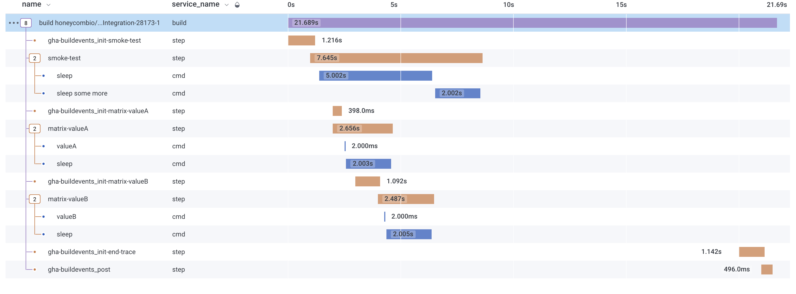
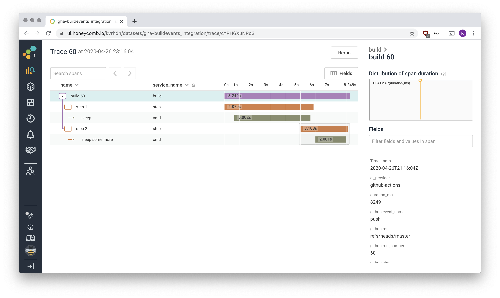

# `gha-buildevents` Action

[](https://github.com/honeycombio/home/blob/main/honeycomb-oss-lifecycle-and-practices.md)
[](https://github.com/honeycombio/gha-buildevents/actions?query=workflow%3ACI)
[](https://github.com/honeycombio/gha-buildevents/actions?query=workflow%3AIntegration)

This GitHub Action instruments your workflows using [Honeycomb's buildevents tool](https://github.com/honeycombio/buildevents). It populates the trace with metadata from the GitHub Actions environment and will always send a trace for the build, even if the build failed.

`gha-buildevents` has to be added to every job that should be instrumented.

### ⚠️ Limitations

- this action only works on Linux hosts (though technically support could be added for other platforms)

- if downloading or executing buildevents fails, the entire job will fail

### 📣 Adopting version 2.0.0

- The required input field `job-status` has been renamed to `status`. This was done because status now can be job's or the workflow's. 
  We still support job-status but will give a warning that it is deprecated and encourage the switch to the status field.


- Each Job MUST include unique STEP IDs to ensure each job's spans are properly organized together.
  - An example of adopting these changes is in the [Integration Worflow](.github/workflows/integration.yaml) of this repo. Here is the corresponding trace:
    

## How to use it

### Single Job Workflow

```yaml
- uses: honeycombio/gha-buildevents@v1
  with:
    # Required: a Honeycomb API key - needed to send traces.
    apikey: ${{ secrets.BUILDEVENTS_APIKEY }}

    # Required: the Honeycomb dataset to send traces to.
    dataset: gha-buildevents_integration

    # Optional: status, this will be used in the post section and sent
    # as status of the trace. Set on the final job of a workflow to signal for the trace to # end
    # job-status has been deprecated
    status: ${{ job.status }}

    # Optional: this should only be used in combination with matrix builds. Set
    # this to a value uniquely describing each matrix configuration.
    matrix-key: ${{ matrix.value }}

# ... the rest of your job ...

# gha-buildevents will automatically run as a post action and execute 'buildevents build'
```

### Multi Job Workflow

In the **FIRST JOB**

Note: The step to start the workflow's trace should run first (before other jobs too)

```yaml
the-job-that-runs-first:
  runs-on: ubuntu-latest
  
  steps:
    - name: Set trace-start
      id: set-trace-start
      run: |
        echo ::set-output name=trace-start::$(date +%s)
    - uses: honeycombio/gha-buildevents@v1
      with:
        # Required: a Honeycomb API key - needed to send traces.
        apikey: ${{ secrets.BUILDEVENTS_APIKEY }}

        # Required: the Honeycomb dataset to send traces to.
        dataset: gha-buildevents_integration

        # Optional: this should only be used in combination with matrix builds. Set
        # this to a value uniquely describing each matrix configuration.
        matrix-key: ${{ matrix.value }}

  # ... the rest of your job ...
  outputs:
      trace-start: ${{ steps.set-trace-start.outputs.trace-start }} 

# ... Job 2 ...
```

Then add the **new** **LAST JOB**

```yaml
end-trace:
  runs-on: ubuntu-latest
  needs: [the-job-that-runs-first, job2]
  if: ${{ always() }}
  steps:
  - uses: technote-space/workflow-conclusion-action@v3
  - uses: honeycombio/gha-buildevents@v1
    with:
      # Required: a Honeycomb API key - needed to send traces.
      apikey: ${{ secrets.BUILDEVENTS_APIKEY }}
      
      # Required: the Honeycomb dataset to send traces to.
      dataset: gha-buildevents_integration
      
      # Optional: status, this will be used in the post section and sent
      # as status of the trace. Set on the final job of a workflow to signal for the trace # to end
      # job-status has been deprecated
      status: ${{ env.WORKFLOW_CONCLUSION }}
      
      # Optional: trace-start, this will be used in the post section and sent
      # to calculate duration of the trace. In multi job workflows, set on the final job of a workflow. Not necessary for single job workflows
      trace-start: ${{ needs.build.outputs.trace-start}}
      
      # Optional: this should only be used in combination with matrix builds. Set
      # this to a value uniquely describing each matrix configuration.
      matrix-key: ${{ matrix.value }}

# gha-buildevents will automatically run as a post action and execute 'buildevents build'
```

`gha-buildevents` is a _wrapping action_. This means it has a post section which will run at the end of the build, after all other steps. In this final step the trace is finalized using `buildevents build`. Since this step runs always, even if the job failed, you don't have to worry about traces not being sent.

### Inputs

Name         | Required | Description                                          | Type
-------------|----------|------------------------------------------------------|-------
`apikey`     | yes      | API key used to communicate with the Honeycomb API.  | string
`dataset`    | yes      | Honeycomb dataset to use.                            | string
`status`     | yes      | The job or workflow status                           | string
`matrix-key` | no       | Set this to a key unique for this matrix cell.       | string

Additionally, the following environment variable will be read:

`BUILDEVENT_FILE`: the path to a file containing additional key-value pairs. Data in this file will be attached to every span sent by buildevents. If this environment variable is not set, `gha-buildevents` will set this to a location outside the working directory.
When setting this environment variable, is recommended to set this [at the beginning of the workflow](https://docs.github.com/en/free-pro-team@latest/actions/reference/workflow-syntax-for-github-actions#env).

### Outputs

No outputs are set, but the following environment variables are set:

`TRACE_ID`: the trace ID is a combination of the repository, the workflow, the job name, the run number, the run attempt, and optionally a matrix key. This trace ID will be unique across re-runs of the workflow. The format:
```
<owner>/<repo>-<workflow>-<job>-<run number>-<run attempt>
```
For example: `honeycombio/gha-buildevents-Integration-smoke-test-20144-1`.

## Example

This repository has its own workflow which will run every hour. See [.github/workflows/integration.yaml](./.github/workflows/integration.yaml).

This workflow will create the following trace in Honeycomb:



## Going further

### Adding arbitrary key-value pairs

To add additional fields to the events sent to Honeycomb, edit the file at the environment variable `BUILDEVENT_FILE`. This file follows [the logfmt style](https://www.brandur.org/logfmt).

The `BUILDEVENT_FILE` environment variable should not be changed during the run, instead it is recommended to configure it at the top-level of your workflow:

```yaml
env:
  BUILDEVENT_FILE: '../buildevents.txt'
```

### Adding additional spans

After `gha-buildevents` has run, `buildevents` will be available on the path. You can use the `buildevents` executable to add additional spans.

`gha-buildevents` sets an environment variable `TRACE_ID`. The trace ID should be used with all buildevents commands to ensure the trace is continued.

To learn more about buildevents and how to use it, checkout [honeycombio/buildevents][buildevents].

```yaml
  # Record the start of the step and, for convenience, set the step ID that will
  # be used for all commands.
- run: |
    echo "STEP_ID=0" >> ${GITHUB_ENV}
    echo "STEP_START=$(date +%s)" >> ${GITHUB_ENV}

  # Wrap the commands that should be traced with 'buildevents cmd'
- run: |
    buildevents cmd $TRACE_ID $STEP_ID sleep-5 -- sleep 5

  # Wrap up the step
- run: |
    buildevents step $TRACE_ID $STEP_ID $STEP_START 'step 1'
```

## License

This Action is distributed under the terms of the MIT license, see [LICENSE](./LICENSE) for details.

## Contributor Alums ❤️

The buildevents GitHub Action was created for the community and generously bequethed to Honeycomb by Koenraad Verheyden ([@kvrhdn](https://github.com/kvrhdn)).
