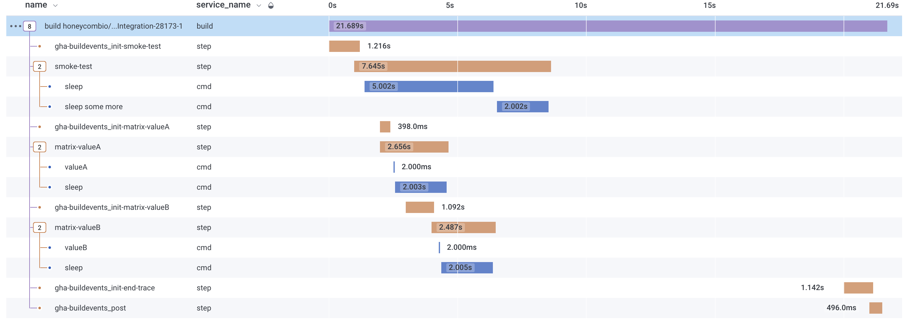
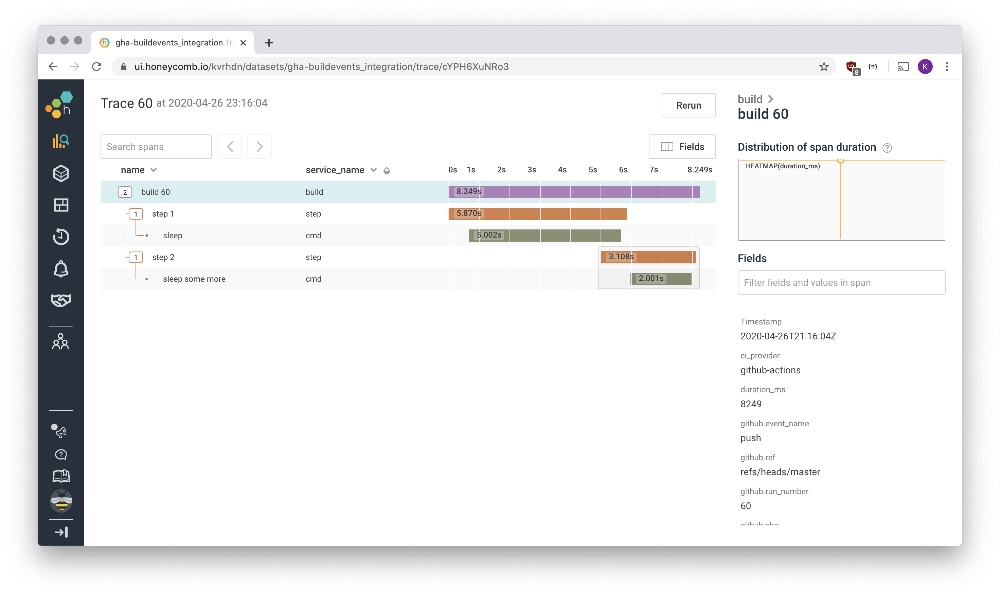

# `gha-buildevents` Action

[](https://github.com/honeycombio/home/blob/main/honeycomb-oss-lifecycle-and-practices.md)
[](https://github.com/honeycombio/gha-buildevents/actions?query=workflow%3ACI)
[](https://github.com/honeycombio/gha-buildevents/actions?query=workflow%3AIntegration)

This GitHub Action instruments your workflows using [Honeycomb's buildevents tool](https://github.com/honeycombio/buildevents). It populates the trace with metadata from the GitHub Actions environment and will always send a trace for the build, even if the build failed.

`gha-buildevents` has to be added to every job that should be instrumented.

## ⚠️ Limitations

- if downloading or executing buildevents fails, the entire job will fail

## 📣 Adopting version 2.0.0

- The input field `job-status` has been renamed to `status`. This is no longer required in every job. This was done because status can now be job status or workflow status.
  We still support job-status but will give a warning that it is deprecated and encourage the switch to the status field.

- `status` is no longer required in every job because including the `status` field ends a trace. For multi job workflows this is only required as part of the last job or the job that will end the trace.

- Each Job MUST include unique STEP IDs to ensure each job's spans are properly organized together.
  - An example of adopting these changes is in the [Integration Worflow](.github/workflows/integration.yaml) of this repo. Here is the corresponding trace:
    

## How to use it

### Single Job Workflow

```yaml
- uses: honeycombio/gha-buildevents@v2
  with:
    # Required: a Honeycomb API key - needed to send traces.
    apikey: ${{ secrets.BUILDEVENT_APIKEY }}

    # Required: the Honeycomb dataset to send traces to.
    dataset: gha-traces

    # Required on the final job: status, this will be used in the post section and sent
    # as status of the trace.
    # Note: in V1 this was called job-status which has been deprecated
    status: ${{ job.status }}

    # Optional: this should only be used in combination with matrix builds. Set
    # this to a value uniquely describing each matrix configuration.
    matrix-key: ${{ matrix.value }}

# ... the rest of your job ...

# gha-buildevents will automatically run as a post action and execute 'buildevents build'
```

### Multi Job Workflow

One job must run first, before other jobs in the workflow.
This job—and *only* this job—needs to record the start time of the trace.

The output of the first job is important.
This is how the `trace-start` timestamp is made available to a new LAST job that ends the trace with a correct duration.

#### In the **FIRST JOB**

```yaml
jobs:
  the-job-that-must-run-first:
    runs-on: ubuntu-latest
    outputs:
        trace-start: ${{ steps.set-trace-start.outputs.trace-start }}
    steps:
      - name: Set trace-start
        id: set-trace-start
        run: |
          echo "trace-start=$(date +%s)" >> $GITHUB_OUTPUT
      - uses: honeycombio/gha-buildevents@v2
        with:
          # Required: a Honeycomb API key - needed to send traces.
          apikey: ${{ secrets.BUILDEVENT_APIKEY }}

          # Required: the Honeycomb dataset to send traces to.
          dataset: gha-traces

          # Optional: this should only be used in combination with matrix builds. Set
          # this to a value uniquely describing each matrix configuration.
          matrix-key: ${{ matrix.value }}
      - run: <the rest of the step(s) of your first job>

  job2:
    needs: [the-job-that-must-run-first] # to ensure first job actually runs first
    steps:
      - uses: honeycombio/gha-buildevents@v2
        with:
          apikey: ${{ secrets.BUILDEVENT_APIKEY }}
          dataset: gha-traces
      # ... the steps for this job
```

#### In the **new** **LAST JOB**

```yaml
jobs:
  # ...
  end-trace:
    runs-on: ubuntu-latest
    # depends on the completion of the tree of jobs to include in the trace
    needs: [the-job-that-must-run-first, job2, ...]
    if: ${{ always() }} # or else failures won't have a complete trace
    steps:
    - uses: honeycombio/gha-buildevents@v2
      with:
        # Required: a Honeycomb API key - needed to send traces.
        apikey: ${{ secrets.BUILDEVENT_APIKEY }}

        # Required: the Honeycomb dataset to send traces to.
        dataset: gha-traces

        # Required (on the final job): status to report on the root span of the trace
        # Note: in V1 this was called job-status which has been deprecated
        status: ${{ contains(needs.*.result, 'failure') && 'failure' || contains(needs.*.result, 'cancelled') && 'cancelled' || 'success' }}

        # Optional: for calculating trace duration for multi-job workflows. Unnecessary for single jobs workflows.
        # Uses the output from the first job that recorded trace start time.
        trace-start: ${{ needs.the-job-that-must-run-first.outputs.trace-start }}

        # Optional: this should only be used in combination with matrix builds.
        # Set this to a value uniquely describing each matrix configuration.
        matrix-key: ${{ matrix.value }}
```

`gha-buildevents` is a *wrapping action*.
This means it has a post section which will run at the end of the workflow, after all other steps.
In this last job, the trace is finalized using `buildevents build`.
Since this step runs always, even if the job failed, you don't have to worry about traces not being sent.

### OpenTelemetry-compatible Trace IDs

A new input, `otel-traceid`, is available:

- If set to `true`, the action will generate the trace ID as a 128-bit hex string compatible with OpenTelemetry. This is done by MD5 hashing the existing predictable trace ID (which is based on repository, workflow, run number, and run attempt). This ensures compatibility with OpenTelemetry trace ID requirements while maintaining repeatability.
- If not set or set to `false`, the original trace ID format is used.

**Example usage:**

```yaml
with:
  otel-traceid: true
```

### Inputs

Name              | Required | Description                                                                                      | Type
------------------|----------|--------------------------------------------------------------------------------------------------|-------
`apikey`          | yes      | API key used to communicate with the Honeycomb API.                                              | string
`dataset`         | yes      | Honeycomb dataset to use.                                                                        | string
`status`          | yes      | The job or workflow status                                                                       | string
`matrix-key`      | no       | Set this to a key unique for this matrix cell.                                                   | string
`send-init-event` | no       | Whether to send an event representing the action setup.                                          | string
`otel-traceid`    | no       | Generate an OTel-compliant trace ID, an MD5 hash of the existing predictable trace ID.           | string

Additionally, the following environment variable will be read:

`BUILDEVENT_FILE`: the path to a file containing additional key-value pairs. Data in this file will be attached to every span sent by buildevents. If this environment variable is not set, `gha-buildevents` will set this to a location outside the working directory.
When setting this environment variable, is recommended to set this [at the beginning of the workflow](https://docs.github.com/en/free-pro-team@latest/actions/reference/workflow-syntax-for-github-actions#env).

### Outputs

No outputs are set, but the following environment variables are set:

`TRACE_ID`: the trace ID is a combination of the repository, the workflow, the job name, the run number, the run attempt, and optionally a matrix key. This trace ID will be unique across re-runs of the workflow. The format:

```plain
<owner>/<repo>-<workflow>-<job>-<run number>-<run attempt>
```

For example: `honeycombio/gha-buildevents-Integration-smoke-test-20144-1`.

If the `otel-traceid` input is set to `true`, the `TRACE_ID` environment variable will instead be a 128-bit hex string (MD5 hash of the above formatted trace ID), compatible with OpenTelemetry trace ID requirements.

## Example

This repository has its own workflow which will run every hour. See [.github/workflows/integration.yaml](./.github/workflows/integration.yaml).

This workflow will create the following trace in Honeycomb:



## Going further

### Adding arbitrary key-value pairs

To add additional fields to the events sent to Honeycomb, edit the file at the environment variable `BUILDEVENT_FILE`. This file follows [the logfmt style](https://www.brandur.org/logfmt).

The `BUILDEVENT_FILE` environment variable should not be changed during the run, instead it is recommended to configure it at the top-level of your workflow:

```yaml
env:
  BUILDEVENT_FILE: '../buildevents.txt'
```

### Adding additional spans

After `gha-buildevents` has run, `buildevents` will be available on the path. You can use the `buildevents` executable to add additional spans.

`gha-buildevents` sets an environment variable `TRACE_ID`. The trace ID should be used with all buildevents commands to ensure the trace is continued.

To learn more about the buildevents CLI and how to use it, checkout [honeycombio/buildevents](https://github.com/honeycombio/buildevents).

```yaml
jobs:
  some-multi-step-job:
    steps:
      # Record the start time of the job and a job ID to act as a parent for the 'cmd' spans.
      - run: |
          echo "JOB_ID=some-multi-step-job" >> ${GITHUB_ENV}
          echo "JOB_START=$(date +%s)" >> ${GITHUB_ENV}
      # Create spans for commands by calling them with 'buildevents cmd'
      - run: |
          buildevents cmd $TRACE_ID $JOB_ID 'Sleepy Time' -- sleep 5
      - run: |
          buildevents cmd $TRACE_ID $JOB_ID 'More Sleep' -- sleep 7
      # Finally ...
      - name: Send parent span for job
        if: ${{ always() }} # to ensure parent span is sent when there are failed steps
        run: |
          buildevents step $TRACE_ID $JOB_ID $JOB_START 'Some Multi Step Job'
```

## License

This Action is distributed under the terms of the MIT license, see [LICENSE](./LICENSE) for details.

## Contributor Alums ❤️

The buildevents GitHub Action was created for the community and generously bequethed to Honeycomb by Koenraad Verheyden ([@kvrhdn](https://github.com/kvrhdn)).
